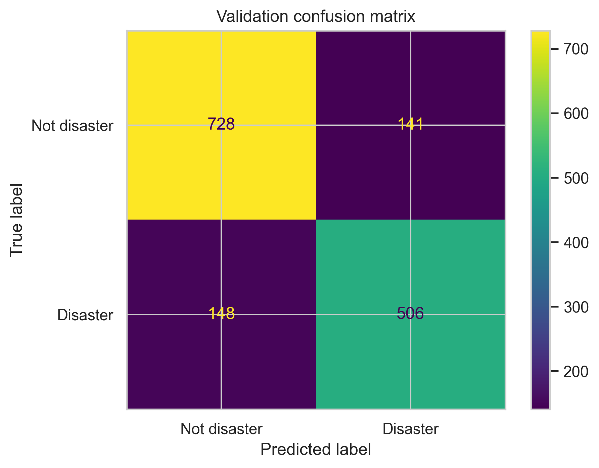

# NLP with Disaster Tweets

This repository hosts a full workflow for the Kaggle competition ["Natural Language Processing with Disaster Tweets"](https://www.kaggle.com/competitions/nlp-getting-started). The goal is to classify whether a tweet describes a real disaster (label `1`) or not (label `0`).

## Project Structure

- `data/` contains the Kaggle-provided CSV files (`train.csv`, `test.csv`, `sample_submission.csv`) and the generated `submission.csv` file.
- `notebooks/disaster_tweets_workflow.ipynb` is the primary analysis notebook covering EDA, feature engineering, modelling, validation, and submission generation.
- `reports/validation_confusion_matrix.png` stores the validation confusion matrix exported from the notebook.

## Notebook Walkthrough

The notebook is structured into themed sections, each introduced by markdown context inside the notebook:

1. **Imports & setup** – Installs required libraries, initialises plotting style, and ensures NLTK resources are present.
2. **Dataset profiling** – Loads CSV files, summarises schema, target balance, and text completeness.
3. **Normalisation & feature signals** – Cleans tweet text, inspects word/character length distributions, and visualises top tokens, keywords, and locations.
4. **Embedding strategies** – Configures bag-of-words, TF-IDF, and GloVe embedding transformers for later reuse.
5. **Model comparison** – Evaluates five pipelines (LogReg/LinearSVC with TF-IDF, ComplementNB/RandomForest with counts, and LogReg with GloVe) via 5-fold stratified CV.
6. **Hyperparameter tuning** – Performs a grid search over TF-IDF logistic regression settings.
7. **Validation hold-out & error review** – Produces a classification report, confusion matrix, and examples of false positives/negatives.
8. **Final training & submission** – Retrains the tuned model on all data, generates test predictions, and saves `submission.csv`.

## Key Outputs

- **Cross-validation comparison (5-fold mean scores):**

  | Model | Accuracy | Precision | Recall | F1 | F1 Std |
  | --- | --- | --- | --- | --- | --- |
  | ComplementNB + CountVectorizer | 0.803 | 0.813 | 0.705 | **0.755** | 0.013 |
  | Logistic Regression + TF-IDF | 0.789 | 0.762 | 0.741 | 0.752 | 0.016 |
  | Logistic Regression + GloVe (100d) | 0.777 | 0.736 | 0.750 | 0.743 | 0.008 |
  | Linear SVM + TF-IDF | 0.777 | 0.747 | 0.728 | 0.737 | 0.010 |
  | Random Forest + CountVectorizer | 0.738 | 0.923 | 0.425 | 0.582 | 0.011 |

  ComplementNB slightly edged out TF-IDF logistic regression on cross-validation F1, but logistic regression offered a better precision/recall balance and interpretability for downstream analysis, so it was selected for tuning and validation.

- **Validation hold-out (20% stratified split):** Overall accuracy `0.81`, with precision `0.83` for non-disaster and `0.78` for disaster tweets. See the confusion matrix below for error distribution.

  

  Most mistakes arise from metaphorical “disaster” language (false positives) and succinct factual reports lacking keywords (false negatives). These insights motivate future feature engineering (keyword usage, contextual embeddings).

- **Submission artifact:** The final cell saves predictions to `data/submission.csv` and previews the first few rows:

  | id | target |
  | -- | ------ |
  | 0  | 1 |
  | 2  | 1 |
  | 3  | 1 |
  | 9  | 1 |
  | 11 | 1 |

## Usage

1. Place the Kaggle competition CSV files (`train.csv`, `test.csv`, `sample_submission.csv`) in the `data/` directory.
2. Open `notebooks/disaster_tweets_workflow.ipynb` in Jupyter or VS Code and run the cells sequentially to reproduce the EDA, modelling, and validation plots.
3. Check `reports/validation_confusion_matrix.png` for the saved confusion matrix and review the classification report printed in the notebook.
4. Submit `data/submission.csv` to Kaggle to receive a leaderboard score.
